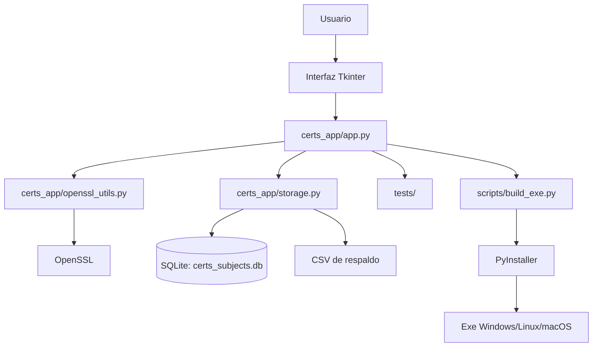

# Diagrama de estructura del software

## Descripción

- La capa de interfaz de usuario recoge los datos del usuario y los distribuye a las funciones de negocio.
- `openssl_utils.py` es la capa de integración con OpenSSL.
- `storage.py` centraliza la persistencia del repositorio de perfiles.
- `build_exe.py` prepara el empaquetado para producir un ejecutable portable.
