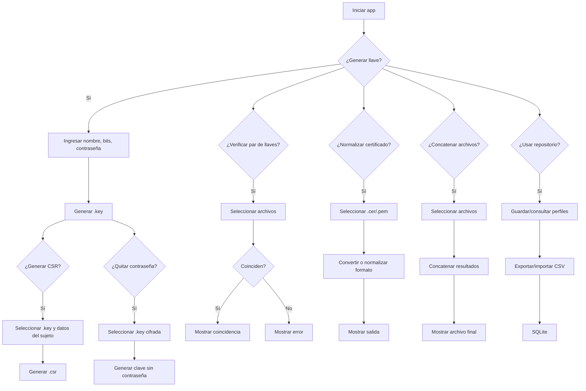

# Diagrama de flujo de funcionalidades

## Resumen del flujo

1. El usuario crea o importa una clave privada.
2. Puede generar un CSR a partir de esa clave.
3. Puede convertir una clave protegida a una sin contraseña.
4. Puede comparar llaves para ver si son compatibles.
5. Puede normalizar certificados para trabajo con PEM o DER.
6. Puede combinar múltiples archivos en una salida final.
7. El repositorio centraliza datos reutilizables y sus respaldos.
